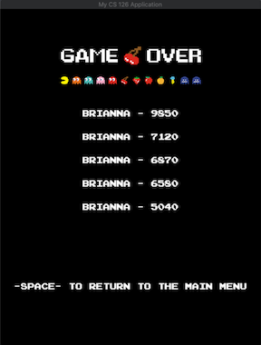

# Final Project

[](LICENSE)
[](docs/README.md)

**Author**: Brianna Zhang - [bjzhang2@illinois.edu](mailto:example@illinois.edu)




###Dependencies:
* [catch2](https://github.com/catchorg/Catch2)
* [choreograph](https://github.com/sansumbrella/Choreograph)
* [cmake](https://cmake.org/)
* [gflags](https://gflags.github.io/gflags/)
* [sqlite3](https://www.sqlite.org/version3.html) 
and [sqlite modern cpp](https://github.com/SqliteModernCpp/sqlite_modern_cpp/tree/dev)

###Game
This is a copy of Pac-Man, a maze arcade game developed and released by Namco in 1980. The gameplay is essentially the 
same. 

#####Objective:
To complete a level, the user must control Pac-Man with the arrow keys and eat all of the food while avoiding the 
ghosts. If Pac-Man hits a ghost, he loses a life. If all three lives are lost, the game is over. The user keeps playing
levels until all three lives are lost.

####Controls
**Key**  | **Action**
---- | ------
```SPACE``` | Move between the main, leaderboard, and game play screens
```RETURN``` | Begin or continue a game
```UP``` | Move Pac-Man up
```DOWN``` | Move Pac-Man down
```LEFT``` | Move Pac-Man left
```RIGHT``` | Move Pac-Man right

To change the username, screen and tile dimensions, and speed or delay of the game, go to 'Edit Configurations'
and add arguments in the format of gflags to 'Program Arguments'.

###Thank You!